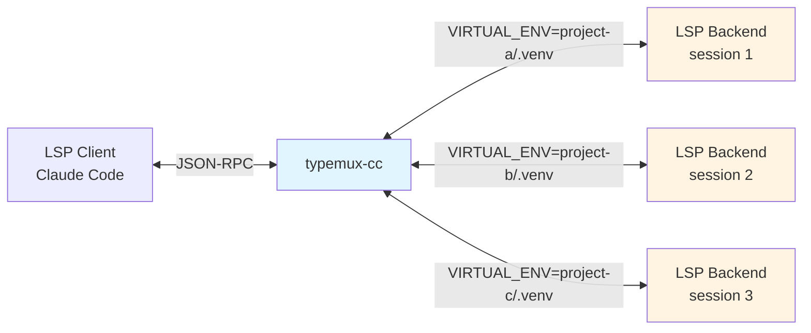
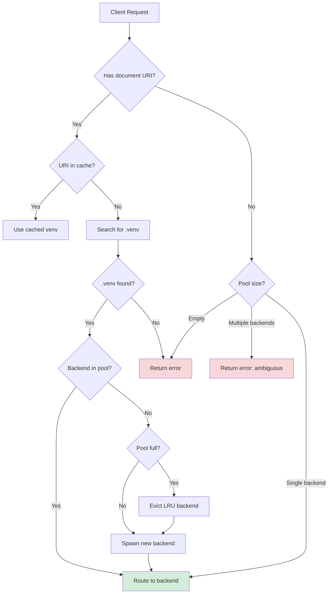
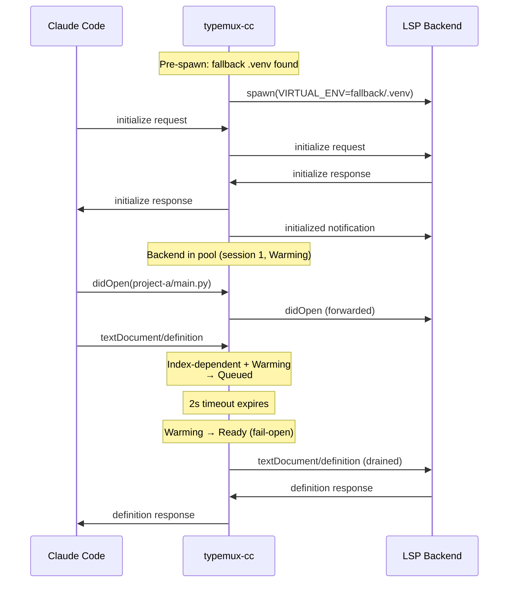
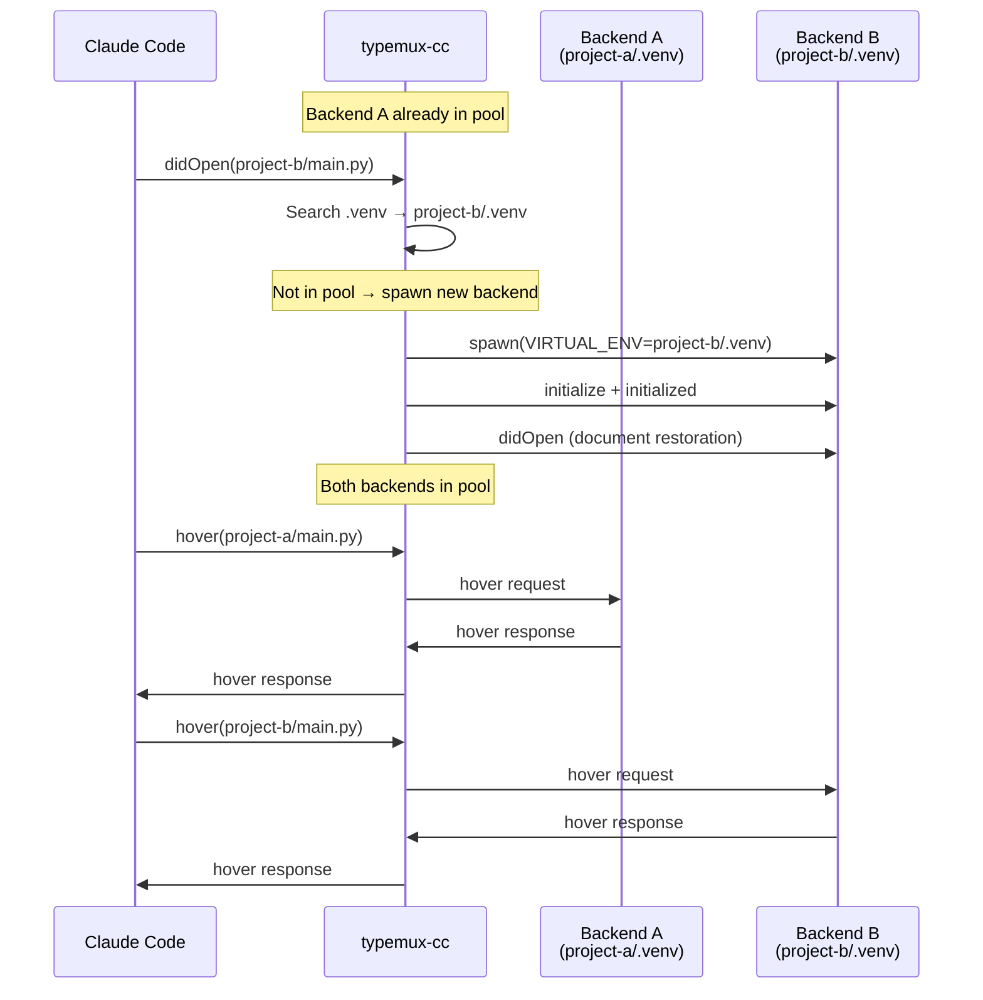

## Design Philosophy: "A Silently Lying LSP Is the Worst"

Running with the wrong `.venv` is worse than disabling LSP functionality and returning errors.

### Why This Matters

- **Offering completions with wrong dependencies** generates code that imports non-existent modules
- **Type checking appears to pass**, but fails at runtime
- **Developers continue coding** based on false information, believing "LSP is working"

### typemux-cc's Choice

- **Explicitly return errors** when `.venv` is not found
- **Explain the situation** in error messages so users can take action
- **"Getting an error" is healthier** than "nothing happening"

This philosophy permeates the entire architecture, from [strict venv mode](/advanced/venv-detection#cache-limitations) to [warmup readiness](/advanced/warmup-readiness) behavior.

## System Architecture

### Overall Structure



The proxy sits between Claude Code and multiple LSP backends (pyright, ty, or pyrefly), performing:

1. **Message routing**: Route JSON-RPC messages to the correct backend based on document venv
2. **venv detection**: Search for `.venv` on:
   - `textDocument/didOpen` (always)
   - Any URI-bearing LSP request on cache miss (fallback to full venv resolution)
   - NOTE: Cached documents reuse the last known venv and are not re-searched
3. **Multi-backend pool**: Manage concurrent backend processes (one per venv, up to `max_backends`)
4. **State restoration**: Resend open documents when spawning a new backend
5. **Diagnostics cleanup**: Clear diagnostics for documents outside the target venv
6. **Warmup readiness**: Queue index-dependent requests until backends finish building their cross-file index

## Message Routing Flow

### Request Routing Decision Tree



### Startup Sequence with Fallback Venv



### Multi-Venv Routing



## Design Principles

### 1. Explicit Errors Over Silent Failures

When `.venv` is not found, typemux-cc returns an explicit error message rather than:
- Using a global Python installation
- Using an incorrect virtual environment
- Silently falling back to limited functionality

<CodeGroup>
```json Error Response
{
  "jsonrpc": "2.0",
  "id": 1,
  "error": {
    "code": -32603,
    "message": "lsp-proxy: .venv not found (strict mode). Create .venv or run hooks."
  }
}
```
</CodeGroup>

### 2. Session-Based Stale Message Detection

Each backend gets a unique session ID (monotonically increasing counter). When a backend crashes or is evicted:

- All pending requests for that session are cancelled
- Responses from old sessions are discarded
- New backend gets a new session ID

**Backend Instance Structure** (`src/backend_pool.rs:44-55`):
```rust
pub struct BackendInstance {
    pub writer: LspFrameWriter<ChildStdin>,
    pub child: Child,
    pub venv_path: PathBuf,
    pub session: u64,              // Unique session ID
    pub last_used: Instant,        // For LRU tracking
    pub reader_task: JoinHandle<()>,
    pub next_id: u64,
    pub warmup_state: WarmupState,
    pub warmup_deadline: Instant,
    pub warmup_queue: Vec<RpcMessage>,
}
```

### 3. Proxy ID Rewriting for Backend Requests

LSP backends can send requests to the client (e.g., `window/workDoneProgress/create`). With multiple backends, their request IDs can collide.

**Solution: Rewrite IDs with negative numbers** (`src/state.rs:80-91`):

1. Backend sends request with its own ID (e.g., `id: 1`)
2. Proxy allocates a unique negative proxy ID (e.g., `id: -1`) to avoid collision with client IDs (positive)
3. Original ID is stored in `pending_backend_requests`
4. Message forwarded to client with rewritten ID
5. Client response routed back, ID restored to original

```rust
/// Allocate a new proxy request ID for server→client requests.
/// Uses negative numbers (decrementing) to avoid collision with client-originated IDs (positive).
pub fn alloc_proxy_request_id(&mut self) -> RpcId {
    let id = self.next_proxy_request_id;
    self.next_proxy_request_id -= 1;
    RpcId::Number(id)
}
```

### 4. Document State Caching for Fast Revival

The proxy maintains an in-memory cache of all open documents (`src/state.rs:30-37`):

```rust
pub struct OpenDocument {
    pub language_id: String,
    pub version: i32,
    pub text: String,
    pub venv: Option<PathBuf>,
}
```

**Why needed:**
- When spawning a backend for a new venv, all relevant documents must be restored
- Client (Claude Code) keeps files open, so backend state must match
- Even without an active backend, `didChange` contents continue to be recorded

**Selective Restoration:** When spawning a backend for `project-b/.venv`, only documents under `project-b/` are restored. Documents under `project-a/` are skipped, and empty diagnostics are sent to clear stale errors.

## Non-Goals

<CardGroup cols={1}>
<Card title="No Multi-Client Support" icon="xmark">
typemux-cc is designed exclusively for Claude Code. No support for other LSP clients.
</Card>

<Card title="No Poetry/Conda/Pipenv" icon="xmark">
Only `.venv` (virtualenv/venv) is supported. No environment resolution for other tools.
</Card>

<Card title="No Mixed Backend Types" icon="xmark">
All backends in the pool must be the same type (pyright, ty, or pyrefly). No simultaneous parallel operation of multiple backend types.
</Card>
</CardGroup>

## Event Loop Architecture

The main event loop in `src/proxy/mod.rs` uses `tokio::select!` with 4 arms:

```
┌─────────────────────────────────────────────────────┐
│                  tokio::select!                     │
├─────────────────────────────────────────────────────┤
│ 1. Client reader     │ stdin JSON-RPC messages      │
│ 2. Backend reader    │ mpsc channel (all backends)  │
│ 3. TTL timer         │ 60s interval sweep           │
│ 4. Warmup timer      │ nearest warmup deadline      │
└─────────────────────────────────────────────────────┘
```

- **Arm 1**: Reads LSP messages from Claude Code via stdin
- **Arm 2**: Receives messages from all backend reader tasks via mpsc channel
- **Arm 3**: Periodic 60s sweep to evict idle backends (TTL-based eviction)
- **Arm 4**: Dynamic deadline for transitioning warming backends to ready (fail-open)

## Source Code Structure

| File | Responsibility |
|------|----------------|
| `main.rs` | Entry point, CLI argument parsing, logging setup |
| `backend.rs` | LSP backend process management (pyright, ty, pyrefly) |
| `backend_pool.rs` | Multi-backend pool, LRU/TTL management, warmup state |
| `state.rs` | Proxy state: pool, documents, pending requests |
| `message.rs` | JSON-RPC message type definitions (RpcMessage, RpcId, RpcError) |
| `framing.rs` | JSON-RPC framing (Content-Length header processing) |
| `text_edit.rs` | Incremental text edit application for didChange |
| `venv.rs` | `.venv` search logic (parent traversal, git toplevel boundary) |
| `error.rs` | Error type definitions (ProxyError, BackendError, etc.) |
| `proxy/mod.rs` | Main event loop (`tokio::select!` with 4 arms) |
| `proxy/client_dispatch.rs` | Client message routing, warmup queueing, cancel handling |
| `proxy/backend_dispatch.rs` | Backend message routing, proxy ID rewriting, progress detection |
| `proxy/pool_management.rs` | LRU/TTL eviction, crash recovery, warmup expiry |
| `proxy/initialization.rs` | Backend initialization handshake, document restoration |
| `proxy/document.rs` | Document tracking (didOpen, didChange, didClose) |
| `proxy/diagnostics.rs` | Diagnostic message handling, stale diagnostics cleanup |

<Tip>
See [Multi-Backend Pool](/advanced/multi-backend-pool) for detailed pool management, [Venv Detection](/advanced/venv-detection) for search algorithm, and [Warmup Readiness](/advanced/warmup-readiness) for index-dependent request queuing.
</Tip>
