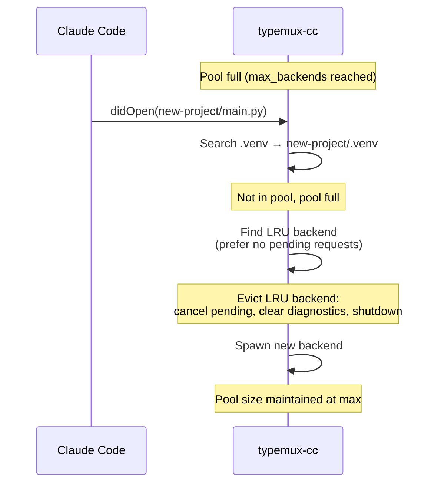

## Design Rationale

Instead of running a single backend and restarting on venv changes, typemux-cc maintains a **pool of concurrent backend processes** — one per venv. This eliminates restart overhead when switching between projects in a monorepo.

<CardGroup cols={2}>
<Card title="Before: Single Backend" icon="rotate">
- Switch venv → kill process → spawn new → re-index
- 5-10s downtime per switch
- Lost state on every transition
</Card>

<Card title="After: Multi-Backend Pool" icon="layer-group">
- Keep multiple backends alive
- Instant switching (already indexed)
- Preserve state per venv
</Card>
</CardGroup>

## Pool Configuration

### Basic Settings

| Parameter | CLI Flag | Environment Variable | Default | Description |
|-----------|----------|---------------------|---------|-------------|
| Max backends | `--max-backends` | `TYPEMUX_CC_MAX_BACKENDS` | `8` | Upper limit on concurrent backend processes |
| Backend TTL | `--backend-ttl` | `TYPEMUX_CC_BACKEND_TTL` | `1800` (30 min) | Idle timeout in seconds (0 = disabled) |

<CodeGroup>
```bash CLI
typemux-cc --max-backends 4 --backend-ttl 900
```

```bash Environment
export TYPEMUX_CC_MAX_BACKENDS=4
export TYPEMUX_CC_BACKEND_TTL=900
typemux-cc
```

```bash Config File
# ~/.config/typemux-cc/config
export TYPEMUX_CC_MAX_BACKENDS="4"
export TYPEMUX_CC_BACKEND_TTL="900"  # 15 minutes
```
</CodeGroup>

### Recommended Settings by Use Case

<AccordionGroup>
<Accordion title="Monorepo with 2-3 projects" defaultOpen>
```bash
--max-backends 4 --backend-ttl 1800
```
- Keeps 1 backend per project + 1 spare
- 30-minute TTL cleans up unused backends
</Accordion>

<Accordion title="Large monorepo (5+ projects)">
```bash
--max-backends 8 --backend-ttl 3600
```
- Higher pool size for frequent project switches
- 1-hour TTL for long coding sessions
</Accordion>

<Accordion title="Single project (no monorepo)">
```bash
--max-backends 2 --backend-ttl 0
```
- Minimal pool (1 backend + 1 spare for nested venvs)
- Disable TTL (backend never evicted)
</Accordion>

<Accordion title="Memory-constrained environments">
```bash
--max-backends 2 --backend-ttl 600
```
- Limit concurrent backends to 2
- Aggressive 10-minute TTL
</Accordion>
</AccordionGroup>

## Backend Instance Structure

Each backend in the pool is represented by a `BackendInstance` (`src/backend_pool.rs:44-55`):

```rust
pub struct BackendInstance {
    pub writer: LspFrameWriter<ChildStdin>,  // Write JSON-RPC to backend
    pub child: Child,                        // Process handle
    pub venv_path: PathBuf,                  // Key: which venv this serves
    pub session: u64,                        // Unique session ID
    pub last_used: Instant,                  // For LRU tracking
    pub reader_task: JoinHandle<()>,         // Background reader task
    pub next_id: u64,                        // Next request ID
    pub warmup_state: WarmupState,           // Warming or Ready
    pub warmup_deadline: Instant,            // When to transition to Ready
    pub warmup_queue: Vec<RpcMessage>,       // Queued requests during warmup
}
```

<Tip>
The `session` field is critical for stale message detection. See [Architecture: Session-Based Detection](/advanced/architecture#session-based-stale-message-detection).
</Tip>

## LRU Eviction Strategy

When the pool reaches `max_backends` and a new backend is needed, typemux-cc evicts the **least recently used (LRU)** backend.

### LRU Selection Algorithm

**Code reference:** `src/backend_pool.rs:156-174`

```rust
pub fn lru_venv(&self, pending_count_fn: impl Fn(&PathBuf, u64) -> usize) -> Option<PathBuf> {
    // First try: find LRU among backends with 0 pending requests
    let no_pending_lru = self
        .backends
        .iter()
        .filter(|(venv, inst)| pending_count_fn(venv, inst.session) == 0)
        .min_by_key(|(_, inst)| inst.last_used)
        .map(|(venv, _)| venv.clone());

    if no_pending_lru.is_some() {
        return no_pending_lru;
    }

    // Fallback: LRU among all backends
    self.backends
        .iter()
        .min_by_key(|(_, inst)| inst.last_used)
        .map(|(venv, _)| venv.clone())
}
```

### Eviction Sequence



### What Happens During Eviction

1. **Cancel pending requests**: All client requests waiting for responses from this backend receive a cancellation error (`-32800`)
2. **Clean up backend requests**: Remove any pending backend→client requests from tracking
3. **Clear diagnostics**: Send empty diagnostic messages to client to clear stale errors from evicted backend
4. **Shutdown process**: Send LSP `shutdown` + `exit` to backend, kill process if unresponsive
5. **Abort reader task**: Stop the background task reading from backend's stdout

<Warning>
If you see frequent evictions in logs (`grep "Evicting LRU backend" /tmp/typemux-cc.log`), increase `--max-backends` to reduce thrashing.
</Warning>

## TTL-Based Eviction

Backends idle for longer than `backend_ttl` are automatically evicted to free resources.

### TTL Sweep Mechanism

- **Interval**: 60 seconds (hardcoded in `src/proxy/mod.rs` event loop)
- **Check**: `Instant::now() - last_used >= backend_ttl`
- **Safety**: Skip backends with pending requests (both client→backend and backend→client)

**Code reference:** `src/proxy/pool_management.rs:95-166`

```rust
pub async fn evict_expired_backends(&mut self, ...) -> Result<(), ProxyError> {
    let expired = self.state.pool.expired_venvs();
    if expired.is_empty() {
        return Ok(());
    }

    for venv_path in expired {
        let session = ...;

        // Skip if there are pending client→backend requests
        let pending_count = self.state.pending_requests
            .values()
            .filter(|p| p.venv_path == venv_path && p.backend_session == session)
            .count();
        if pending_count > 0 {
            continue;  // Don't evict — backend is in use
        }

        // Skip if there are pending backend→client requests
        let pending_backend_count = self.state.pending_backend_requests
            .values()
            .filter(|p| p.venv_path == venv_path && p.session == session)
            .count();
        if pending_backend_count > 0 {
            continue;  // Don't evict — backend is in use
        }

        // Safe to evict — no pending requests
        ...
    }
}
```

### TTL Behavior Examples

<Tabs>
<Tab title="Default TTL (30 min)">
```bash
# Backend idle for 30 minutes → evicted
typemux-cc  # Uses default --backend-ttl 1800
```

Timeline:
- 10:00 AM: User opens file in project-a → backend spawned
- 10:30 AM: User switches to project-b → project-a backend becomes idle
- 11:00 AM: TTL expires, project-a backend evicted (pool size: 1)
</Tab>

<Tab title="Short TTL (10 min)">
```bash
# Aggressive eviction for memory-constrained systems
typemux-cc --backend-ttl 600
```

Timeline:
- 2:00 PM: User opens file in project-x → backend spawned
- 2:10 PM: User idle (no requests to project-x)
- 2:11 PM: Next TTL sweep evicts project-x backend
</Tab>

<Tab title="Disabled TTL">
```bash
# Never auto-evict (only LRU eviction when pool full)
typemux-cc --backend-ttl 0
```

Backends remain in pool indefinitely until:
- Pool reaches `max_backends` → LRU eviction
- typemux-cc process exits
- Backend crashes
</Tab>
</Tabs>

## Session Tracking

### Session ID Generation

Each backend gets a **unique, monotonically increasing session ID** when spawned:

**Code reference:** `src/backend_pool.rs:176-180`

```rust
pub fn next_session_id(&mut self) -> u64 {
    self.next_session += 1;
    self.next_session
}
```

Starting from 0, each new backend (including re-spawns after crashes) gets the next ID: 1, 2, 3, ...

### Session Validation

Every message received from a backend includes its session ID. Before processing, the proxy checks:

**Code reference:** `src/proxy/backend_dispatch.rs:23-49`

```rust
let is_current = self
    .state
    .pool
    .get(&venv_path)
    .is_some_and(|inst| inst.session == session);

if !is_current {
    // Discard stale message from evicted/crashed backend
    return Ok(());
}
```

### Why Session IDs Matter

<CardGroup cols={2}>
<Card title="Without Session IDs" icon="xmark">
**Problem:** Backend crashes, new backend spawned with same venv path. Old responses arrive → forwarded to client → **wrong data**.

Example:
1. Backend session 1 serves project-a/.venv
2. Client sends request ID 42
3. Backend session 1 crashes
4. New backend session 2 spawned for project-a/.venv
5. Old response from session 1 arrives (wrong index state)
6. ❌ Client receives stale response
</Card>

<Card title="With Session IDs" icon="check">
**Solution:** Responses from old sessions are discarded.

Example:
1. Backend session 1 serves project-a/.venv
2. Client sends request ID 42 (recorded as session 1)
3. Backend session 1 crashes
4. New backend session 2 spawned for project-a/.venv
5. Old response from session 1 arrives
6. ✅ Proxy discards (session 1 != session 2)
7. Client receives cancellation error for request 42
</Card>
</CardGroup>

## Pool State Inspection

### Current Pool Status

To see which backends are in the pool:

```bash
# Enable debug logging
RUST_LOG=debug typemux-cc

# Tail logs
tail -f /tmp/typemux-cc.log
```

Look for log lines like:
```
[INFO] Creating new backend for venv=/path/to/project-a/.venv session=1
[INFO] Backend already in pool, reusing session=1
[INFO] Evicting LRU backend venv=/path/to/project-b/.venv session=2
```

### Pool Activity Monitoring

```bash
# Real-time pool changes
grep -E "(Creating new backend|Evicting|Backend warmup)" /tmp/typemux-cc.log | tail -f

# Count current backends (approximation from logs)
grep "Creating new backend" /tmp/typemux-cc.log | tail -n 8

# Session lifecycle
grep "session=" /tmp/typemux-cc.log | grep -E "(Starting|completed|Evicting)"
```

## Memory Considerations

Each backend process (pyright/ty/pyrefly) typically uses:

| Backend | Typical Memory | Peak Memory | Notes |
|---------|----------------|-------------|-------|
| pyright | 100-300 MB | 500 MB | Higher for large codebases |
| ty | 200-400 MB | 800 MB | Rust-based, aggressive caching |
| pyrefly | 150-350 MB | 600 MB | Similar to pyright |

<Warning>
**Rule of thumb:** Allow ~500 MB per backend. For `--max-backends 8`, reserve ~4 GB RAM for the pool.
</Warning>

### Memory-Constrained Recommendations

If running on systems with limited RAM (e.g., 8 GB with other applications):

```bash
# Conservative pool size + aggressive TTL
typemux-cc --max-backends 2 --backend-ttl 600
```

Or monitor with:
```bash
# Watch memory usage
watch -n 5 'ps aux | grep -E "(pyright|ty|pyrefly)" | grep -v grep'
```

## Performance Tuning

### Monorepo with Frequent Switches

**Problem:** Switching between 5 projects every few minutes.

**Solution:**
```bash
# Large pool + long TTL
typemux-cc --max-backends 8 --backend-ttl 3600
```

### Single Project with Nested Venvs

**Problem:** Main project + test venv + docs venv (3 total).

**Solution:**
```bash
# Small pool + no TTL
typemux-cc --max-backends 4 --backend-ttl 0
```

### CI/CD or Short-Lived Sessions

**Problem:** Running typemux-cc in automated environments (tests, CI).

**Solution:**
```bash
# Minimal pool + disable TTL (process exits soon anyway)
typemux-cc --max-backends 2 --backend-ttl 0
```

<Tip>
Start with defaults (`--max-backends 8 --backend-ttl 1800`) and adjust based on `grep "Evicting" /tmp/typemux-cc.log` frequency.
</Tip>
