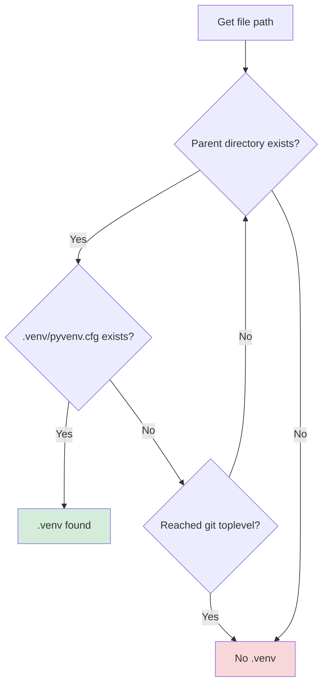

## Search Algorithm

typemux-cc searches for `.venv` by traversing parent directories upward from the opened file, stopping at the git repository root.

### Search Flow



### Implementation Details

**Code reference:** `src/venv.rs:34-96`

```rust
pub async fn find_venv(
    file_path: &Path,
    git_toplevel: Option<&Path>,
) -> Result<Option<PathBuf>, VenvError> {
    // Start from file's parent directory
    let mut current = file_path.parent();
    let mut depth = 0;

    while let Some(dir) = current {
        // Stop if we exceed git toplevel
        if let Some(toplevel) = git_toplevel {
            if !dir.starts_with(toplevel) {
                break;
            }
        }

        // Check for .venv/pyvenv.cfg existence
        let venv_path = dir.join(VENV_DIR);
        let pyvenv_cfg = venv_path.join(PYVENV_CFG);

        if pyvenv_cfg.exists() {
            return Ok(Some(venv_path));
        }

        // Move to parent directory
        current = dir.parent();
        depth += 1;
    }

    Ok(None)  // No .venv found
}
```

### Search Rules

<Steps>
<Step title="Starting point">
Parent directory of opened file (not the file itself)
</Step>

<Step title="Verification">
Check existence of `.venv/pyvenv.cfg` (not just `.venv` directory)
</Step>

<Step title="Boundary">
Git repository root (obtained at startup via `git rev-parse --show-toplevel`)
</Step>

<Step title="Direction">
Traverse upward through parent directories until boundary or `.venv` found
</Step>
</Steps>

### Example Traversal

<Tabs>
<Tab title="Monorepo Structure">
```
monorepo/                     # git toplevel
├── .venv/                    # ✅ Found at depth 2
│   └── pyvenv.cfg
├── project-a/
│   └── src/
│       └── main.py           # ← File opened here
└── project-b/
    ├── .venv/                # ❌ Not searched (different branch)
    │   └── pyvenv.cfg
    └── app.py
```

**Search path for `project-a/src/main.py`:**
1. Check `project-a/src/.venv/pyvenv.cfg` → ❌
2. Check `project-a/.venv/pyvenv.cfg` → ❌
3. Check `monorepo/.venv/pyvenv.cfg` → ✅ **Found**
</Tab>

<Tab title="Nested Projects">
```
workspace/                    # git toplevel
├── main-project/
│   ├── .venv/                # ✅ Found at depth 1
│   │   └── pyvenv.cfg
│   └── app.py                # ← File opened here
└── docs/
    ├── .venv/                # Different venv for docs
    │   └── pyvenv.cfg
    └── conf.py
```

**Search path for `main-project/app.py`:**
1. Check `main-project/.venv/pyvenv.cfg` → ✅ **Found**

**Search path for `docs/conf.py`:**
1. Check `docs/.venv/pyvenv.cfg` → ✅ **Found** (different backend spawned)
</Tab>

<Tab title="No venv">
```
project/                      # git toplevel
├── src/
│   └── main.py               # ← File opened here
└── README.md
```

**Search path for `src/main.py`:**
1. Check `src/.venv/pyvenv.cfg` → ❌
2. Check `project/.venv/pyvenv.cfg` → ❌
3. Reached git toplevel → ❌ **No venv found**

**Result:** Error returned to client (`lsp-proxy: .venv not found (strict mode)`)
</Tab>
</Tabs>

## Git Toplevel Boundary

### Why Git Toplevel?

The git repository root provides a natural boundary for venv search:

- **Prevents escaping workspace**: Stops search from going into parent directories outside the project
- **Performance**: Limits search depth in deeply nested directory structures
- **Semantic boundary**: Git repo typically == project boundary

### Fallback When Not in Git Repo

If `git rev-parse --show-toplevel` fails (not in a git repo), search continues up to filesystem root (`/` on Unix, drive root on Windows).

**Code reference:** `src/venv.rs:9-32`

```rust
pub async fn get_git_toplevel(working_dir: &Path) -> Result<Option<PathBuf>, VenvError> {
    let output = match Command::new("git")
        .args(["rev-parse", "--show-toplevel"])
        .current_dir(working_dir)
        .output()
        .await
    {
        Ok(output) => output,
        Err(e) => {
            tracing::warn!(error = ?e, "git command failed, continuing without git");
            return Ok(None);  // Not an error — just no git boundary
        }
    };

    if output.status.success() {
        let path_str = String::from_utf8_lossy(&output.stdout);
        let path = PathBuf::from(path_str.trim());
        Ok(Some(path))
    } else {
        Ok(None)  // Not in a git repository
    }
}
```

<Warning>
Without a git boundary, venv search may traverse very deep directory structures (e.g., from `/home/user/workspace/project/subproject/src/file.py` up to `/home/user/.venv`). Always run typemux-cc inside a git repository for best performance.
</Warning>

## Fallback .venv Search Order

At **startup** (before any files are opened), typemux-cc attempts to pre-spawn a backend with a fallback venv.

### Search Order

<Steps>
<Step title="1. Git toplevel">
Check `.venv` at `$(git rev-parse --show-toplevel)/.venv`

```bash
git rev-parse --show-toplevel
# → /home/user/monorepo

# Check: /home/user/monorepo/.venv/pyvenv.cfg
```
</Step>

<Step title="2. Current working directory">
Check `.venv` at `$PWD/.venv`

```bash
pwd
# → /home/user/monorepo/project-a

# Check: /home/user/monorepo/project-a/.venv/pyvenv.cfg
```
</Step>

<Step title="3. No fallback">
Start without pre-spawned backend (backends created on-demand)
</Step>
</Steps>

**Code reference:** `src/venv.rs:98-155`

### Fallback Behavior Examples

<Tabs>
<Tab title="Monorepo (git toplevel .venv)">
```bash
cd /home/user/monorepo
ls .venv/pyvenv.cfg
# → exists

# typemux-cc starts
# → Pre-spawn backend with VIRTUAL_ENV=/home/user/monorepo/.venv
```

**Logs:**
```
[INFO] Fallback .venv found at git toplevel venv=/home/user/monorepo/.venv
[INFO] Pre-spawning fallback backend
```
</Tab>

<Tab title="Nested project (cwd .venv)">
```bash
cd /home/user/monorepo/project-a
ls .venv/pyvenv.cfg
# → exists

ls /home/user/monorepo/.venv/pyvenv.cfg
# → does not exist

# typemux-cc starts
# → Pre-spawn backend with VIRTUAL_ENV=/home/user/monorepo/project-a/.venv
```

**Logs:**
```
[INFO] Fallback .venv found at cwd venv=/home/user/monorepo/project-a/.venv
[INFO] Pre-spawning fallback backend
```
</Tab>

<Tab title="No fallback">
```bash
cd /home/user/monorepo
ls .venv/pyvenv.cfg
# → does not exist

# typemux-cc starts
# → No pre-spawned backend (backends created on first didOpen)
```

**Logs:**
```
[WARN] No fallback .venv found
[INFO] Starting without pre-spawned backend
```
</Tab>
</Tabs>

## Cache Behavior and Limitations

### Document Cache

When a file is opened via `textDocument/didOpen`, typemux-cc caches:

- **URI**: `file:///path/to/file.py`
- **Language ID**: `python`
- **Version**: LSP document version number
- **Text**: Full file contents
- **Venv**: Resolved `.venv` path (or `None` if not found)

**Code reference:** `src/state.rs:30-37`

```rust
pub struct OpenDocument {
    pub language_id: String,
    pub version: i32,
    pub text: String,
    pub venv: Option<PathBuf>,  // ← Cached venv path
}
```

### When Venv is Re-searched

<CardGroup cols={2}>
<Card title="Always Re-search" icon="rotate">
- `textDocument/didOpen` (explicit file open)
- Cache miss on URI-bearing request (file not in cache)
</Card>

<Card title="Never Re-search" icon="ban">
- `textDocument/didChange` (uses cached venv)
- `textDocument/hover` on cached file (uses cached venv)
- Any request for a file already in cache
</Card>
</CardGroup>

### Cache Limitations

<Warning>
**Critical limitation:** Creating `.venv` **after** opening a file will not take effect until the file is reopened.
</Warning>

#### Example Problem Scenario

<Steps>
<Step title="User opens file without .venv">
```bash
# No .venv exists yet
cd /home/user/project

# Claude Code opens main.py
# typemux-cc searches for .venv → not found
# Error returned: "lsp-proxy: .venv not found (strict mode)"
```

**Cache state:**
```rust
OpenDocument {
    uri: "file:///home/user/project/main.py",
    venv: None,  // ← Cached as "no venv"
}
```
</Step>

<Step title="User creates .venv">
```bash
# User runs uv init or creates .venv manually
uv venv

# .venv now exists!
ls .venv/pyvenv.cfg
# → exists
```
</Step>

<Step title="Cached venv still None">
```bash
# User triggers textDocument/hover in Claude Code
# typemux-cc looks up cache → venv: None (stale!)
# Still returns error (no re-search performed)
```

**Why?** `textDocument/hover` on a cached file does not trigger venv re-search.
</Step>

<Step title="Workaround: Reopen file">
```bash
# User closes and reopens main.py in Claude Code
# → textDocument/didClose (clears cache)
# → textDocument/didOpen (re-searches venv)
# → .venv found! Backend spawned
```

**New cache state:**
```rust
OpenDocument {
    uri: "file:///home/user/project/main.py",
    venv: Some("/home/user/project/.venv"),  // ← Updated
}
```
</Step>
</Steps>

### Workarounds for Stale Cache

<Accordion title="Option 1: Restart Claude Code (Full Reset)" icon="rotate">
Cleanest solution — clears all cached state.

```bash
# macOS
Cmd+Q (quit Claude Code)
# Reopen Claude Code

# Linux
killall claude-code  # or use your window manager
# Reopen Claude Code
```

**Pros:** Guaranteed to work  
**Cons:** Loses all open tabs, window state, etc.
</Accordion>

<Accordion title="Option 2: Close and Reopen File" icon="file">
Lightweight — only clears cache for specific file.

**In Claude Code:**
1. Close the file tab
2. Reopen the file from file explorer

**Triggers:**
- `textDocument/didClose` → cache entry removed
- `textDocument/didOpen` → fresh venv search

**Pros:** No need to restart editor  
**Cons:** Must repeat for each open file
</Accordion>

<Accordion title="Option 3: Create .venv Before Opening Files" icon="check">
Best practice — avoids the problem entirely.

```bash
# Always create .venv first
cd /home/user/project
uv venv  # or python -m venv .venv

# Then open Claude Code
code .
```

**Pros:** No cache staleness  
**Cons:** Requires discipline
</Accordion>

## Debugging Venv Detection

### Enable Detailed Logging

```bash
# Trace-level logs show each search step
RUST_LOG=trace TYPEMUX_CC_LOG_FILE=/tmp/typemux-cc.log typemux-cc
```

### Useful Log Queries

<CodeGroup>
```bash Venv Search Activity
# Show all venv search attempts
grep "Starting .venv search" /tmp/typemux-cc.log

# Show successful detections
grep ".venv found" /tmp/typemux-cc.log

# Show failures
grep "No .venv found" /tmp/typemux-cc.log
```

```bash Search Depth Analysis
# How deep does search traverse?
grep "depth=" /tmp/typemux-cc.log | grep "Searching for .venv"
```

```bash Git Boundary Issues
# Check git toplevel detection
grep "Git toplevel" /tmp/typemux-cc.log

# Check if search hit git boundary
grep "Reached git toplevel boundary" /tmp/typemux-cc.log
```

```bash Cache Hit/Miss
# File opened (always searches)
grep "didOpen" /tmp/typemux-cc.log

# Request on uncached file (fallback search)
grep "URI not in cache" /tmp/typemux-cc.log
```
</CodeGroup>

### Manual Verification

To manually check if typemux-cc will find your `.venv`:

<Tabs>
<Tab title="From Project Root">
```bash
cd /path/to/your/project

# Check git toplevel
git rev-parse --show-toplevel
# → Should output project root

# Check .venv exists with pyvenv.cfg
ls .venv/pyvenv.cfg
# → Should exist

# Start typemux-cc
RUST_LOG=debug TYPEMUX_CC_LOG_FILE=/tmp/typemux-cc.log typemux-cc

# Check logs
grep "Fallback .venv found" /tmp/typemux-cc.log
```
</Tab>

<Tab title="From Subdirectory">
```bash
cd /path/to/your/project/subdir/src

# Check git toplevel
git rev-parse --show-toplevel
# → Should output project root (not subdir)

# Check .venv exists relative to git toplevel
ls $(git rev-parse --show-toplevel)/.venv/pyvenv.cfg
# → Should exist

# Simulate search from a file
cd /path/to/your/project
find . -name "*.py" -type f | head -1
# → ./subdir/src/main.py

# typemux-cc will search:
# 1. ./subdir/src/.venv/pyvenv.cfg (no)
# 2. ./subdir/.venv/pyvenv.cfg (no)
# 3. ./.venv/pyvenv.cfg (yes!)
```
</Tab>
</Tabs>

## Why pyvenv.cfg?

typemux-cc checks for `.venv/pyvenv.cfg` (not just `.venv` directory) because:

1. **Standard marker**: All virtualenvs created by `python -m venv`, `virtualenv`, or `uv venv` contain `pyvenv.cfg`
2. **Avoids false positives**: Prevents detecting unrelated `.venv` directories (e.g., manually created folders)
3. **Contains metadata**: `pyvenv.cfg` includes `home` path to base Python interpreter

<Info>
If your virtual environment doesn't have `pyvenv.cfg`, it's likely not a standard virtualenv. typemux-cc **only supports standard `.venv` environments** (see [Architecture: Non-Goals](/advanced/architecture#non-goals)).
</Info>

## Performance Characteristics

- **Search time**: O(depth) — typically 1-5 directory checks
- **Cache lookup**: O(1) — hash map lookup by URI
- **Git toplevel**: Cached on first call (single `git` subprocess at startup)

<Tip>
Venv search is **not** a performance bottleneck. The search happens only on file open (once per file) and is fast (< 1ms for typical depths).
</Tip>
