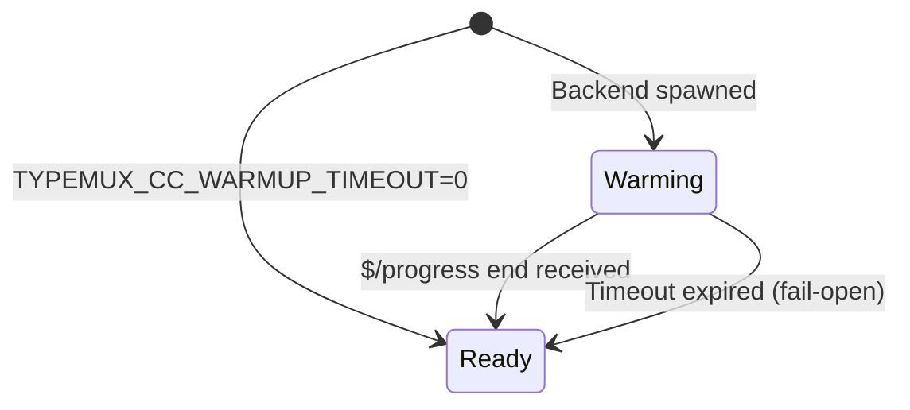

## Why Warmup is Needed

After spawning, LSP backends (pyright, ty, pyrefly) need time to build their **cross-file index**. Requests sent during this warmup period return incomplete results:

<CardGroup cols={2}>
<Card title="During Warmup (Incomplete)" icon="hourglass-half">
- `findReferences` returns **same-file only** (missing cross-project references)
- `goToDefinition` on re-exported symbols returns **empty**
- Type errors **not detected** if symbol defined in another file
</Card>

<Card title="After Warmup (Complete)" icon="check">
- `findReferences` returns **all references** across the project
- `goToDefinition` follows imports and re-exports correctly
- Full type checking with cross-file dependencies
</Card>
</CardGroup>

### Real-World Example

<Tabs>
<Tab title="Problem: Sent Too Early">
```python
# project/models/user.py
class User:
    def get_name(self) -> str:
        return self.name

# project/services/auth.py
from models.user import User

def authenticate(user: User):
    return user.get_name()  # ← Request "Find References" here
```

**Without warmup queuing:**
1. User opens `auth.py` → backend spawned (warming)
2. User immediately clicks "Find References" on `get_name`
3. Backend hasn't indexed `user.py` yet
4. **Result:** Only shows reference in `auth.py` (incorrect!)

**With warmup queuing:**
1. User opens `auth.py` → backend spawned (warming)
2. User clicks "Find References" on `get_name` → **queued**
3. Backend finishes indexing (2s later) → **transitions to Ready**
4. Queued request forwarded to backend
5. **Result:** Shows references in both `auth.py` and `user.py` (correct!)
</Tab>

<Tab title="Safe: Non-Index Requests">
```python
# project/main.py
def calculate(a: int, b: int) -> int:
    return a + b  # ← Request "Hover" here
```

**During warmup:**
- Hover → **forwarded immediately** (doesn't need index)
- documentSymbol → **forwarded immediately** (only reads current file)
- didOpen/didChange → **forwarded immediately** (needed for indexing)

**Rationale:** These requests don't depend on cross-file index, so safe to send during warmup.
</Tab>
</Tabs>

## Warming vs Ready States

Each backend instance tracks its warmup state in the pool.

### State Definitions

**Code reference:** `src/backend_pool.rs:13-21`

```rust
#[derive(Debug, Clone, Copy, PartialEq, Eq)]
pub enum WarmupState {
    Warming,  // Queueing index-dependent requests
    Ready,    // All requests forwarded normally
}
```

### State Transition Diagram



### Transition Triggers

<Steps>
<Step title="Spawn (→ Warming)">
New backend starts in `Warming` state (unless timeout is 0).

**Code reference:** `src/proxy/client_dispatch.rs:55-61`

```rust
let timeout = warmup_timeout();
let instance = BackendInstance {
    warmup_state: if timeout.is_zero() {
        WarmupState::Ready  // Warmup disabled
    } else {
        WarmupState::Warming  // Default: queue requests
    },
    warmup_deadline: Instant::now() + timeout,
    warmup_queue: Vec::new(),
    // ...
};
```
</Step>

<Step title="Progress Signal (→ Ready)">
Backend sends `$/progress` notification with `kind: "end"`.

**Code reference:** `src/proxy/backend_dispatch.rs:110-134`

```rust
if msg.is_notification() {
    if let Some(method) = msg.method_name() {
        if method == "$/progress" && is_progress_end(&msg) {
            if let Some(inst) = self.state.pool.get_mut(&venv_path) {
                if inst.is_warming() {
                    tracing::info!("Backend warmup complete (reason: progress)");
                    let queued = inst.mark_ready();
                    // Forward queued requests...
                }
            }
        }
    }
}
```

**Progress detection:**
```rust
fn is_progress_end(msg: &RpcMessage) -> bool {
    msg.params
        .as_ref()
        .and_then(|p| p.get("value"))
        .and_then(|v| v.get("kind"))
        .and_then(|k| k.as_str())
        == Some("end")
}
```
</Step>

<Step title="Timeout Expiry (→ Ready, Fail-Open)">
If progress signal never arrives, **fail-open** after timeout.

**Code reference:** `src/proxy/pool_management.rs:264-302`

```rust
pub async fn expire_warmup_backends(&mut self, ...) -> Result<(), ProxyError> {
    let expired: Vec<PathBuf> = self
        .state
        .pool
        .warming_backends()
        .into_iter()
        .filter(|venv| {
            self.state
                .pool
                .get(venv)
                .is_some_and(|inst| inst.warmup_expired())
        })
        .collect();

    for venv_path in expired {
        tracing::info!("Backend warmup complete (reason: timeout), transitioning to Ready (fail-open)");
        let queued = inst.mark_ready();
        // Forward queued requests...
    }
}
```

**Why fail-open?** If backend never signals readiness (bug, slow machine, etc.), better to forward requests (potentially incomplete results) than block forever.
</Step>
</Steps>

## Which Requests are Queued

Only **index-dependent** requests are queued during warmup.

### Queued Methods (Index-Dependent)

**Code reference:** `src/proxy/client_dispatch.rs:11-17`

```rust
const INDEX_DEPENDENT_METHODS: &[&str] = &[
    "textDocument/definition",
    "textDocument/references",
    "textDocument/implementation",
    "textDocument/typeDefinition",
];
```

| Method | Queued During Warmup? | Reason |
|--------|----------------------|--------|
| `textDocument/definition` | ✅ Yes | Needs cross-file imports/exports |
| `textDocument/references` | ✅ Yes | Needs full project index |
| `textDocument/implementation` | ✅ Yes | Needs inheritance hierarchy |
| `textDocument/typeDefinition` | ✅ Yes | Needs type alias resolution |

### Forwarded Immediately (Not Queued)

| Method | Queued During Warmup? | Reason |
|--------|----------------------|--------|
| `textDocument/hover` | ❌ No | Same-file scope suffices |
| `textDocument/documentSymbol` | ❌ No | Only reads current file |
| `textDocument/completion` | ❌ No | Partial results acceptable |
| `textDocument/didOpen` | ❌ No | Needed for indexing itself |
| `textDocument/didChange` | ❌ No | Updates backend state |
| `textDocument/didClose` | ❌ No | Cleanup notification |
| All other requests/notifications | ❌ No | Default: forward |

### Queueing Logic

**Code reference:** `src/proxy/client_dispatch.rs:337-359`

```rust
// Queue index-dependent requests during warmup
if let Some(method_name) = method {
    if inst.is_warming() && INDEX_DEPENDENT_METHODS.contains(&method_name) {
        // Register in pending requests (for cancel/crash handling)
        if let Some(id) = &msg.id {
            self.state.pending_requests.insert(
                id.clone(),
                crate::state::PendingRequest {
                    backend_session: session,
                    venv_path: venv_path.clone(),
                },
            );
        }
        tracing::info!(
            method = method_name,
            id = ?msg.id,
            "Queueing index-dependent request during warmup"
        );
        inst.warmup_queue.push(msg.clone());
        return Ok(());
    }
}
```

## Timeout Behavior

### Default Timeout

**2 seconds** (configurable via `TYPEMUX_CC_WARMUP_TIMEOUT`).

**Code reference:** `src/backend_pool.rs:24-34`

```rust
const DEFAULT_WARMUP_TIMEOUT: Duration = Duration::from_secs(2);

pub fn warmup_timeout() -> Duration {
    std::env::var("TYPEMUX_CC_WARMUP_TIMEOUT")
        .ok()
        .and_then(|v| v.parse::<u64>().ok())
        .map(Duration::from_secs)
        .unwrap_or(DEFAULT_WARMUP_TIMEOUT)
}
```

### Timeout Event Loop Arm

The main event loop has a dedicated arm for warmup expiry:

**Code reference:** `src/proxy/mod.rs` (conceptual, see actual source)

```rust
tokio::select! {
    // Arm 1: Client messages (stdin)
    result = client_reader.read_message() => { ... }

    // Arm 2: Backend messages (mpsc channel)
    Some(backend_msg) = state.pool.backend_msg_rx.recv() => { ... }

    // Arm 3: TTL timer (60s interval)
    _ = ttl_timer.tick() => { ... }

    // Arm 4: Warmup timer (nearest warmup deadline)
    _ = sleep_until(nearest_deadline) => {
        expire_warmup_backends(&mut state, &mut client_writer).await?;
    }
}
```

**Dynamic deadline:** The warmup timer uses `nearest_warmup_deadline()` to sleep until the soonest backend expires. This avoids polling and ensures immediate transition when timeout occurs.

### Timeout Scenarios

<Tabs>
<Tab title="Fast Backend (< 2s)">
```
0.0s: Backend spawned (Warming, deadline at 2.0s)
0.5s: User sends textDocument/definition → queued
1.2s: Backend sends $/progress end → Ready
1.2s: Queued request forwarded immediately
```

**Outcome:** Progress signal wins, timeout never fires.
</Tab>

<Tab title="Slow Backend (> 2s)">
```
0.0s: Backend spawned (Warming, deadline at 2.0s)
0.5s: User sends textDocument/definition → queued
2.0s: Timeout expires → Ready (fail-open)
2.0s: Queued request forwarded
3.5s: Backend sends $/progress end → ignored (already Ready)
```

**Outcome:** Timeout wins, request forwarded with potentially incomplete index.
</Tab>

<Tab title="No Queued Requests">
```
0.0s: Backend spawned (Warming, deadline at 2.0s)
0.5s: User sends textDocument/hover → forwarded immediately (not queued)
2.0s: Timeout expires → Ready (empty queue, no-op)
```

**Outcome:** Timeout fires but has no effect (no queued requests to drain).
</Tab>
</Tabs>

## Configuration

### Environment Variable

| Variable | Type | Default | Description |
|----------|------|---------|-------------|
| `TYPEMUX_CC_WARMUP_TIMEOUT` | seconds | `2` | Duration to wait for backend readiness |

### Configuration Examples

<CodeGroup>
```bash Default (2s)
# Standard timeout — good for most systems
typemux-cc
```

```bash Longer Timeout (5s)
# For slow machines or large codebases
TYPEMUX_CC_WARMUP_TIMEOUT=5 typemux-cc
```

```bash Shorter Timeout (1s)
# For fast systems with SSD + small codebases
TYPEMUX_CC_WARMUP_TIMEOUT=1 typemux-cc
```

```bash Disable Warmup (0s)
# Skip warmup entirely (backends start Ready)
TYPEMUX_CC_WARMUP_TIMEOUT=0 typemux-cc
```
</CodeGroup>

### Config File Setup

For persistent configuration:

```bash
mkdir -p ~/.config/typemux-cc
cat > ~/.config/typemux-cc/config << 'EOF'
# Backend selection
export TYPEMUX_CC_BACKEND="ty"

# Warmup timeout (seconds)
export TYPEMUX_CC_WARMUP_TIMEOUT="3"

# Logging
export TYPEMUX_CC_LOG_FILE="/tmp/typemux-cc.log"
export RUST_LOG="typemux_cc=debug"
EOF

# Restart Claude Code to apply
```

### When to Disable Warmup

<Warning>
Disabling warmup (`TYPEMUX_CC_WARMUP_TIMEOUT=0`) means index-dependent requests may return incomplete results immediately after backend spawn. Only disable if you understand the trade-off.
</Warning>

**Use cases for disabling:**

- **Testing/debugging**: Simpler behavior, no queuing logic
- **Pre-indexed backends**: If you know the backend re-uses a persistent index (some LSP servers cache indexes on disk)
- **Single-file workflows**: If you never use cross-file features (references, implementations)

## Queue Behavior Details

### Queue Structure

Each backend maintains a FIFO queue of pending requests.

**Code reference:** `src/backend_pool.rs:54`

```rust
pub warmup_queue: Vec<RpcMessage>,  // Queued requests during warmup
```

### Draining the Queue

When transitioning to Ready, queued requests are **drained in order** and forwarded to the backend.

**Code reference:** `src/backend_pool.rs:72-83`

```rust
pub fn mark_ready(&mut self) -> Vec<RpcMessage> {
    self.warmup_state = WarmupState::Ready;
    let queued = std::mem::take(&mut self.warmup_queue);
    if !queued.is_empty() {
        tracing::info!(
            venv = %self.venv_path.display(),
            queued_count = queued.len(),
            "Warmup complete, draining queued requests"
        );
    }
    queued
}
```

**Draining loop:** `src/proxy/client_dispatch.rs:491-555`

```rust
pub async fn drain_warmup_queue(
    &mut self,
    venv_path: &PathBuf,
    expected_session: u64,
    queued: Vec<RpcMessage>,
    client_writer: &mut LspFrameWriter<tokio::io::Stdout>,
) -> Result<(), ProxyError> {
    for request in queued {
        // Session guard: if backend was replaced (crash + re-create),
        // discard remaining queued requests
        let session_ok = self
            .state
            .pool
            .get(venv_path)
            .is_some_and(|inst| inst.session == expected_session);
        if !session_ok {
            tracing::warn!("Aborting warmup drain: backend session changed");
            // Remove from pending_requests...
            continue;
        }

        // Forward request to backend
        if let Some(inst) = self.state.pool.get_mut(venv_path) {
            inst.writer.write_message(&request).await?;
        }
    }
    Ok(())
}
```

### Queue Cancellation

If the user cancels a queued request via `$/cancelRequest`:

**Code reference:** `src/proxy/client_dispatch.rs:463-487`

```rust
pub async fn dispatch_cancel_request(&mut self, msg: &RpcMessage) -> Result<(), ProxyError> {
    if let Some(cancelled_id) = extract_cancel_id(msg) {
        if let Some(pending) = self.state.pending_requests.get(&cancelled_id).cloned() {
            if let Some(inst) = self.state.pool.get_mut(&pending.venv_path) {
                if inst.session == pending.backend_session
                    && inst.cancel_warmup_request(&cancelled_id).is_some()
                {
                    tracing::info!(
                        id = ?cancelled_id,
                        "Cancelled warmup-queued request"
                    );
                    self.state.pending_requests.remove(&cancelled_id);
                    return Ok(());
                }
            }
        }
    }

    // Not in warmup queue — forward $/cancelRequest to all backends
    self.dispatch_client_notification(msg).await
}
```

**Behavior:**
- If request is in warmup queue → **remove from queue** (never forwarded to backend)
- If request already forwarded → **forward cancel** to backend

### Session Guard During Drain

If a backend crashes **while draining** and is replaced with a new session:

```rust
let session_ok = self
    .state
    .pool
    .get(venv_path)
    .is_some_and(|inst| inst.session == expected_session);
if !session_ok {
    // Backend session changed (crash + respawn) — abort drain
    self.state.pending_requests.remove(&request.id);
    continue;
}
```

This prevents forwarding old queued requests to a new backend instance.

## Monitoring Warmup Activity

### Enable Debug Logging

```bash
RUST_LOG=debug TYPEMUX_CC_LOG_FILE=/tmp/typemux-cc.log typemux-cc
```

### Useful Log Queries

<CodeGroup>
```bash Warmup Transitions
# Show all warmup state changes
grep -E "(warmup complete|transitioning to Ready)" /tmp/typemux-cc.log

# Count progress-triggered vs timeout-triggered
grep "warmup complete (reason: progress)" /tmp/typemux-cc.log | wc -l
grep "warmup complete (reason: timeout)" /tmp/typemux-cc.log | wc -l
```

```bash Queue Activity
# Show queued requests
grep "Queueing index-dependent request" /tmp/typemux-cc.log

# Show queue draining
grep "draining queued requests" /tmp/typemux-cc.log

# Check queue sizes
grep "queued_count=" /tmp/typemux-cc.log
```

```bash Cancellation
# Show cancelled warmup requests
grep "Cancelled warmup-queued request" /tmp/typemux-cc.log
```

```bash Session Guard Events
# Show drain aborts due to session change
grep "Aborting warmup drain: backend session changed" /tmp/typemux-cc.log
```
</CodeGroup>

### Real-Time Monitoring

```bash
# Watch warmup activity live
tail -f /tmp/typemux-cc.log | grep -E "(Warming|Ready|queued)"
```

## Performance Impact

<CardGroup cols={2}>
<Card title="Overhead" icon="clock">
- **Latency**: +2s max for index-dependent requests (only once per backend spawn)
- **Memory**: ~1 KB per queued request (typically 0-5 requests)
- **CPU**: Negligible (queue is a simple Vec)
</Card>

<Card title="Benefits" icon="shield-check">
- **Correctness**: Ensures complete results for cross-file queries
- **UX**: Prevents confusing partial results ("why didn't it find this reference?")
- **Reliability**: Fail-open means no indefinite blocking
</Card>
</CardGroup>

<Tip>
In practice, most backends signal readiness via `$/progress` within 500ms-1.5s. The 2s timeout is a safety net, not a common occurrence.
</Tip>
